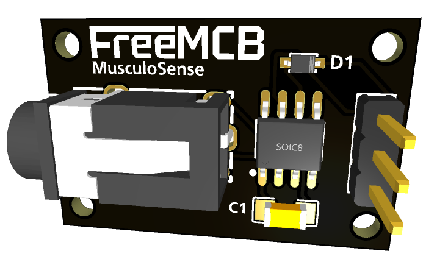

# MusculoSense

The MusculoSense EMG Module is a cutting-edge solution designed to provide accurate and reliable electromyography (EMG) measurements in a compact and user-friendly form factor. Featuring the highly renowned INA128 integrated instrumentation amplifier, this module ensures exceptional signal amplification and noise reduction, enabling precise analysis of muscle activity.

	

> Note: MusculoSense is still in experimental stage.

The module is equipped with a 3.5mm cable connection, allowing seamless integration with a variety of devices such as microcontrollers, computers, and data acquisition systems. The inclusion of a 1N4148 diode ensures efficient half-wave signal rectification, providing reliable protection when used with sensitive electronics, making it an ideal choice for applications requiring EMG interfacing.

With the MusculoSense EMG Module, researchers, healthcare professionals, and bioengineers can delve into the world of electromyography with utmost confidence. Whether you are involved in sports performance analysis, neuromuscular research, or rehabilitation engineering, this module provides the tools necessary to unlock deeper insights into muscle function and activity.

## Key Features:

- **High-precision EMG measurements**: The INA128 integrated instrumentation amplifier guarantees accurate signal amplification, resulting in reliable EMG measurements.

- **Low-noise design**: Advanced noise reduction techniques ensure minimal interference and enhanced signal fidelity, enabling precise analysis of muscle activity.

- **Versatile connectivity**: The 3.5mm cable connection enables seamless integration with a wide range of devices, allowing for flexibility in data acquisition and analysis.

- **Signal protection**: The integrated 1N4148 diode provides effective half-wave signal rectification, safeguarding sensitive electronics and microcontrollers.

- **Compact and user-friendly**: The module's compact design and user-friendly interface make it easy to incorporate into existing setups and experimental environments.

- **Durable construction**: Built with high-quality components and materials, the MusculoSense EMG Module is engineered to withstand demanding research and clinical environments.

## Unlocking the Potential of MusculoSense

- **Sports performance analysis**: Gain insights into muscle activation patterns during sports activities, enabling targeted training programs and performance optimization.

- **Neuromuscular research**: Investigate muscle behavior and neuromuscular disorders, aiding in the development of innovative therapies and rehabilitation techniques.

- **Rehabilitation engineering**: Monitor muscle activity during rehabilitation processes, providing valuable feedback for personalized treatment plans and progress tracking.

Trust the MusculoSense EMG Module for accurate, reliable, and efficient EMG analysis. Discover new dimensions in muscle monitoring and unleash the power of electromyography with confidence.

## License

MusculoSense is licensed under [MIT Public License](MIT Public License).